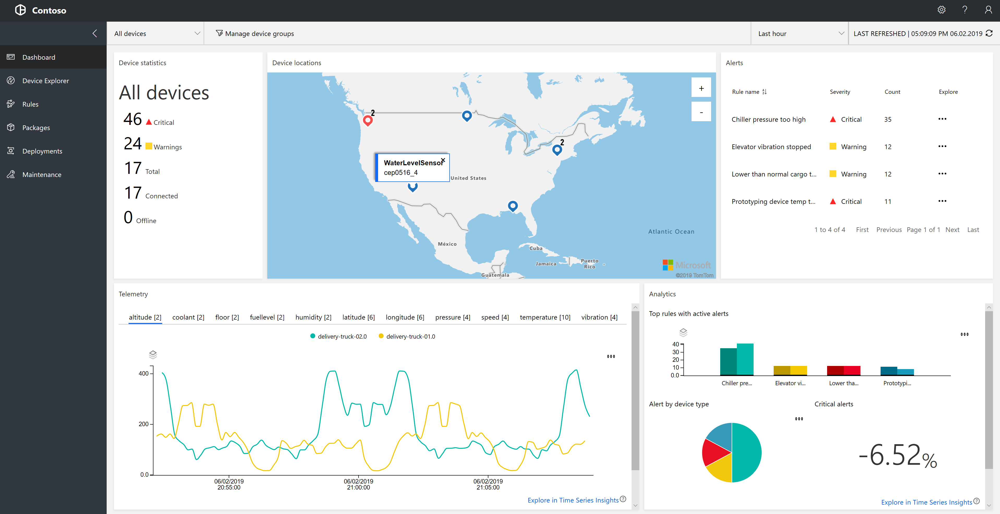
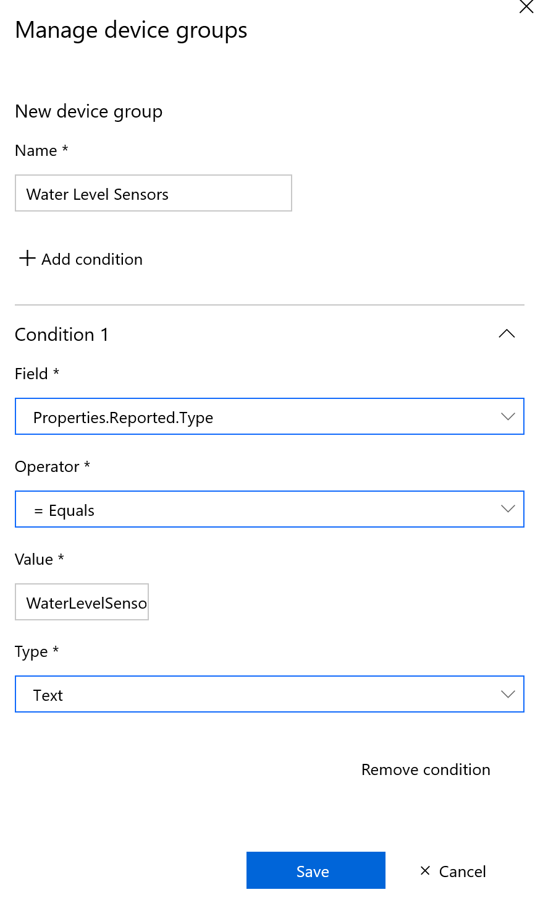
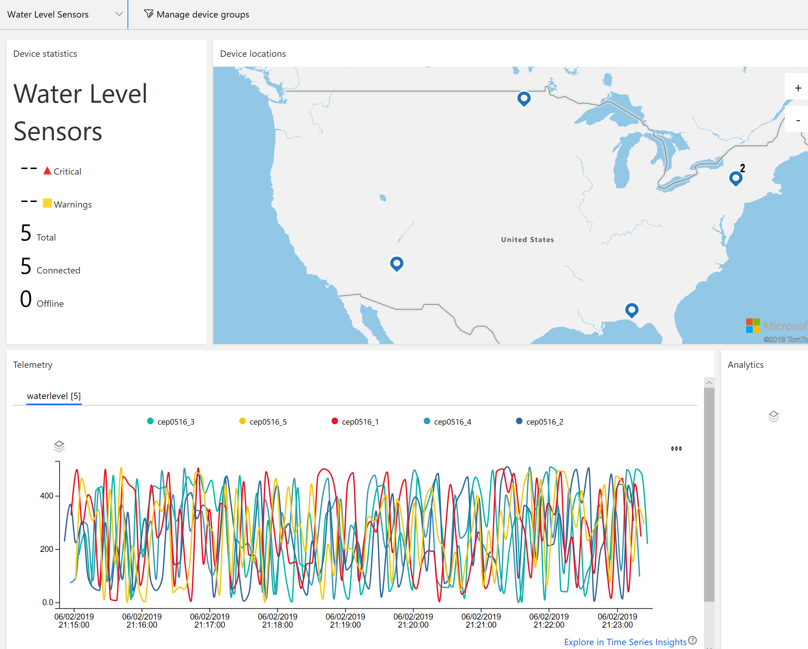
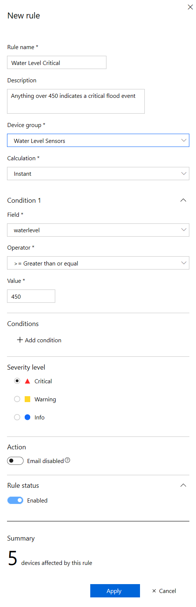
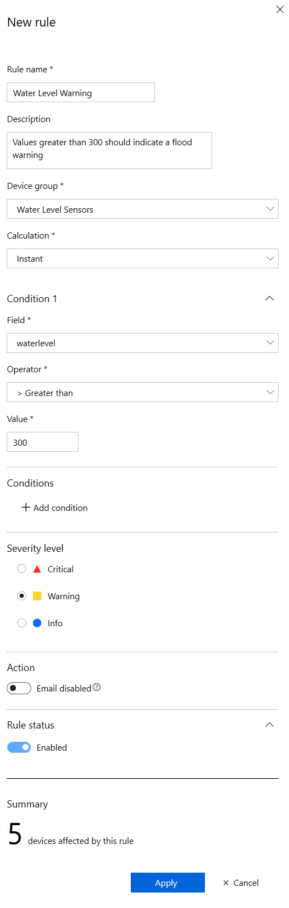
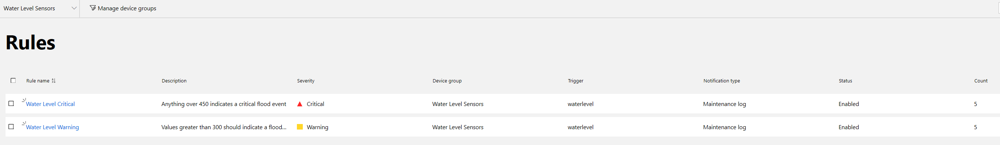
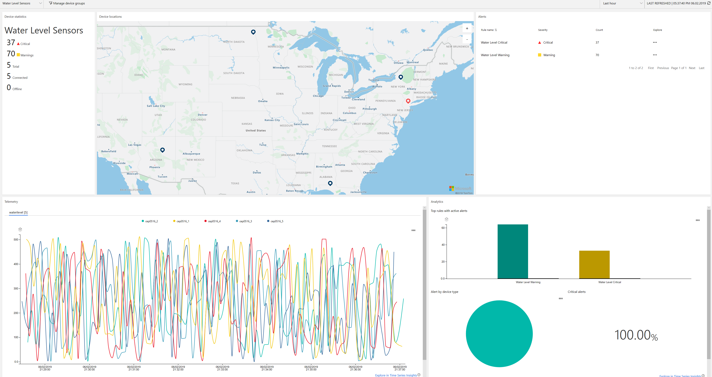

# Visualizing Data and Setting Up Alerts

## Now that we have data, what do we do with it?

It seems like most IoT projects seem to focus on provisioning devices, designing hardware, obtaining the right circuits, provisioning and getting the information to the cloud. While all of this is important, the true value of an IoT system resides with its data and how it's used. 

To demonstrate this process, we will take a look at the Azure IoT Remote Monitoring Accelerator. Over many years of accrued IoT experience, Microsoft has curated a series of cloud web applications, deployable with a single click that solve many of the common requirements desired from IoT systems. A listing of each of the accelerators is available at [www.azureiotsolutions.com](https://www.azureiotsolutions.com).

The Remote Monitoring Accelerator allows you to visualize the location of devices on a map, and setup rules for warnings and critical events. Our emulator project is already setup using a common Twin schema and messaging so that our emulated devices will feed directly into this solution.

You may deploy the accelerator using the accelerator site above, ensure that you select to use your existing IoT hub that we created in Lab 5.

## Creating a device group

In order to better view only the water level sensor data, create a device group. At the top of the screen press the **Manage device groups** button, then the **Create new device group** button.

We will define the group based on the Device Type submitted to Azure through the Device Twin Reported Properties. In our emulator - we set the Type property to *WaterLevelSensor*.

With the Device Group created, we are able to filter each view of the web application so that we view only data from our emulated water level devices. It makes for a pretty colorful graph. Latitude and Longitude used on the map is also obtained based on the reported properties of the device.

## Create rules to define alert and warning conditions

In the left-hand menu, select the **Rules** menu item. If your screen is filtered by the Water Level Sensors device group, the table will be empty. Create a new rule by pressing the **+ New rule** button near the top right of the screen.

The first rule we will define is a Critical alert for water level values being reported at greater than 450. The application knows the telemetry data structure through the *Telemetry* reported property that is available in the Device Twin.

Create a second rule, which we'll define as a warning for values greater than 300.

Let the emulator run for a few minutes for the alerts to start triggering and show up on the dashboard.

Once warning and critical events are logged, the dashboard will populate with further information showing the breakdown of alerts detected from the data flowing into the IoT Hub.

While not in scope for this lab, the IoT Remote Monitoring solution is equipped with the ability to remediate issues remotely. Through cloud to device messaging, the application can initiate method calls on the device itself. In this case, it could be to open a dam, pull a plug, etc.

