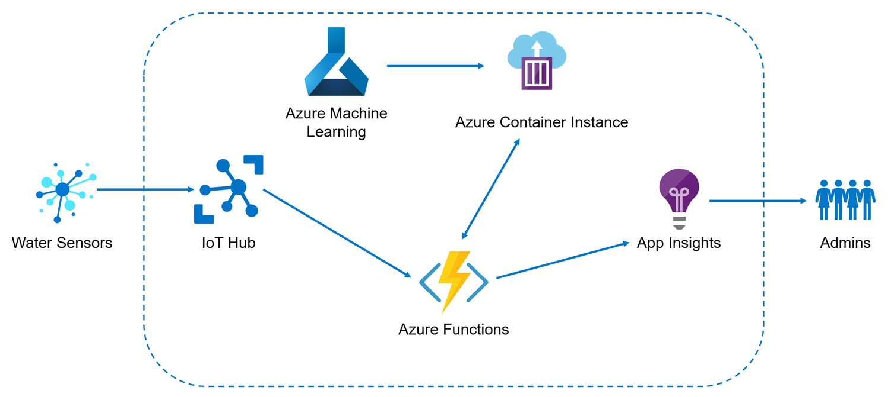
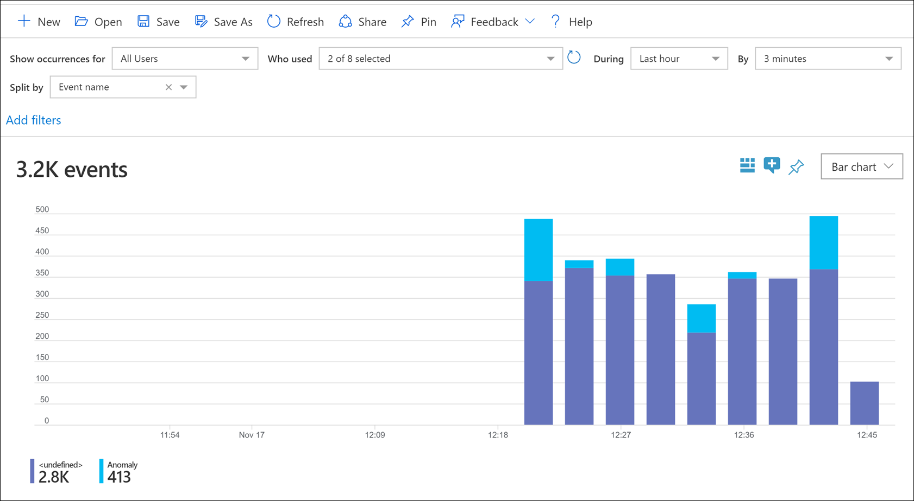

# Lab 4: Stream processing and real-time scoring

In this lab, you will build a stream processing pipeline to consume IoT events from IoT Hub, transform and aggregate the data, and send the prepared data to the deployed machine learning (ML) model for real-time scoring.

The project consists of a data generator console application that registers simulated IoT devices to IoT Hub and sends water sensor telemetry. It also includes an Azure Functions project that contains the event processing logic to prepare the data and send it to the deployed ML model to detect anomalies in real time. You can run the function locally, or choose to deploy it to Azure.

When the deployed ML model detects an anomaly in the sensor data, the function logs a custom event in Application Insights, named `Anomaly`. These custom events, along with all Azure Functions telemetry, are stored by Application Insights for analysis and logging. Alerts are created within Application Insights to notify admins when certain thresholds are met, such as *n* anomalies within *x* seconds.

Application Insights displaying Anomaly events compared to requests to the Azure Functions instance:

## Pre-requisites

- [Visual Studio 2019 community](https://visualstudio.microsoft.com/vs/community/)
- [Visual Studio **.NET Desktop Development** and **ASP.NET and Web Development** Workloads](https://docs.microsoft.com/en-us/visualstudio/install/modify-visual-studio?view=vs-2019)
- [.NET Core 3.0 **SDK**](https://dotnet.microsoft.com/download/dotnet-core/3.0)

## Configure the data generator and Azure Functions projects

1. Open the **Day2/SourceCode/WaterSensorPrediction/WaterSensorPrediction.sln** solution file in Visual Studio.

2. In Solution Explorer, expand the **WaterSensorPredictionGenerator** console project and open the **appsettings.json** file. Update the `IOT_HUB_CONNECTION_STRING` value by pasting the **Event Hub-compatible endpoint** value from your IoT Hub service.

   

3. To find this value, navigate to the Azure portal (<https://portal.azure.com>), open your IoT Hub service, select **Shared access policies** in the left-hand menu, select the **iothubowner** policy, then copy the **Connection string--primary key** value.

   

4. Save the file.

5. In Solution Explorer, expand the **WaterSensorPredictionFunction** Azure Functions project and open the **local.settings.json** file. Update the `IotHubConnectionString` value by pasting the **Event Hub-compatible endpoint** value from your IoT Hub service. Next, update the `ScoringServiceUrl` value by pasting the URL to your deployed ML model that is displayed at the bottom of the `anomaly_detection_lab3.ipynb` notebook. Finally, update the `APPINSIGHTS_INSTRUMENTATIONKEY` value with your Application Insights instrumentation key.

   

6. To find the `IotHubConnectionString` value, navigate to the Azure portal (<https://portal.azure.com>), open your IoT Hub service, select **Built-in endpoints** in the left-hand menu, then copy the **Event Hub-compatible endpoint** value.

   

7. To find the `APPINSIGHTS_INSTRUMENTATIONKEY` value, navigate to the Azure portal, open your lab Resource Group, then locate the Application Insights service that was automatically provisioned when you created the Azure Machine Learning service workspace. If you cannot find an Application Insights instance, create a new one. Within the Overview blade, find and copy the **Instrumentation Key** value.

   

8. Save the file.

## Execute the data generator and run the Azure function locally

Now that the data generator and Azure Functions projects have been configured, it's time to run them locally.

1. In Visual Studio, right-click the **WaterSensorPredictionFunction** Azure Functions project, select **Debug**, then **Start new instance**.

   

2. In a moment, the Azure Functions runtime will launch in a new console window. **Let this continually run for the remainder of the lab.**

   

3. In Visual Studio, right-click the **WaterSensorPredictionGenerator** console project, select **Debug**, then **Start new instance**.

4. Open both console windows side-by-side and observe the outputs of each. After a brief period, depending on your computer and network speed, you will begin seeing messages output in the Azure Functions window in yellow, stating "_Anomaly detected within the following device: {deviceId}_". This occurs when the function sends the sensor data to the deployed ML model hosted in the Azure Container Instance (ACI) container, and the model sends back a prediction that an anomaly has occurred. Each of the blue lines in the output ("_Executed 'WaterLevelAnomalyFunction'..._") represent each time the function is triggered by sensor events flowing through IoT Hub.

   

5. Allow both of these windows to remain open in the background for the next task.