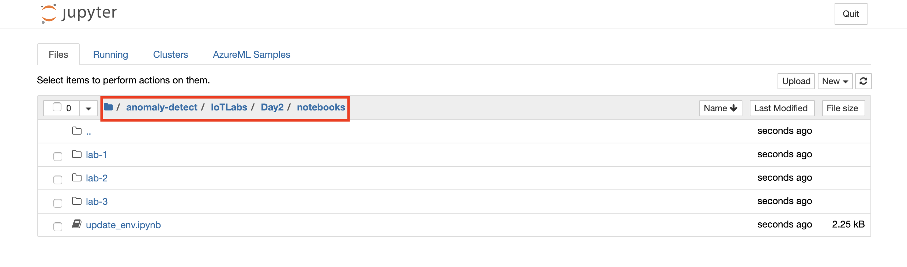

# Azure Notebook VMs Setup

At a high level, here are the setup tasks you will need to perform to prepare your Azure Notebook VM Environment (the detailed instructions follow):

1. Create a Notebook VM in your Azure subscription

2. Import the Lab Notebooks

3. Update your Notebook Environment 

## Task 1: Create a Notebook VM

1. Log into [Azure Portal](https://portal.azure.com/) and open the machine learning workspace.

2. Select **Compute** in the left navigation and from the **Notebook VMs** tab, select **New**

   

3. Provide Name: `anomaly-vm` and Virtual machine size: `STANDARD_D3_V2` and then select **Create**

   
  
4. Wait for the VM to be ready, it will take around 5-10 minutes.

## Task 2: Import the Lab Notebooks

1. Select the Notebook VM: **anomaly-vm** and then select **Jupyter**, to open Jupyter Notebooks interface.

   

2. Select **New, Terminal** as shown to open the terminal page.

   
  
3. Run the following commands in order in the terminal window:

   a. `mkdir anomaly-detect`
   
   b. `cd anomaly-detect`
   
   c. `git clone https://github.com/solliancenet/IoTLabs.git`
   
      
   
   d. Wait for the import to complete.

## Task 3: Update your Notebook Environment 

1.  From the Jupyter Notebooks interface, navigate to the `quick-starts->azure-machine-learning-quickstarts->aml-python-sdk->starter-artifacts->nbvm-notebooks` folder where you will find all your quickstart files.

   

2. Open notebook: **00-aml-setup/00-aml-setup.ipynb**

3. Run each cell in the notebook to install the required libraries.
