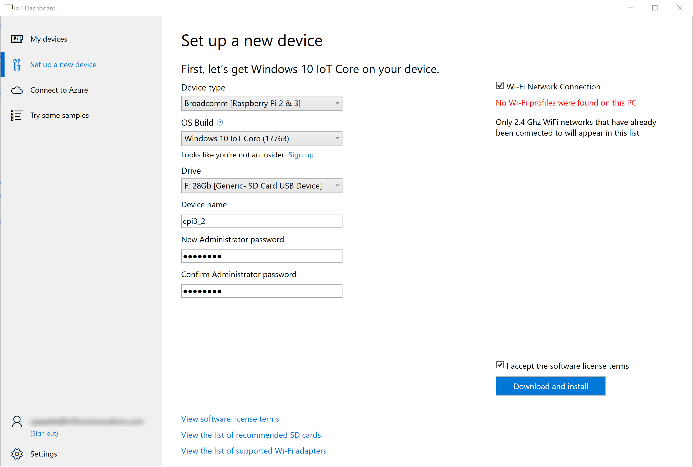

# Creating the Operating System Image
## Install the IoT Dashboard
Download the IoT Dashboard application
[IoT Dashboard Application](https://docs.microsoft.com/en-us/windows/iot-core/downloads)
## Prepare the SD Card
* Insert micro-SD card into the SD card adapter and insert it into the SD Card Reader
* Open the IoT Dashboard application, and sign in using your Microsoft Account
* From the IoT Dashboard application menu, select **Setup a new Device**
* In the Operating system drop down, select **Broadcomm [Rasbperry Pi 2 & 3]**
* For OS Build, select **Windows 10 IoT Core (Build 17763)**
* Ensure your SD card is correctly selected for the Drive (this should be detected automatically)
* Give your device a unique name on the network, for the context of this lab - please use your 3 initials followed by the month and day of your birth - for instance CEP0516
* Provide and confirm a password for the *Administrator* user of the Raspberry Pi - please make it something that you will remember.
* Ensure the WiFi connection box is checked and select our lab network WiFi connection. Please note, the IoT Dashboard application sometimes has trouble identifying WiFi networks, rest assured you can set this up later on the device itself. If no networks are displayed, simply ignore this step.
* Accept the license terms
* Click the download and install - the image will download and install on the SD card. A Command window will appear to complete the installation. At any time multiple File Explorer windows may open, simply close them. If prompted to format a drive in these File explorer windows, select cancel. This is due to a bug that Microsoft and Microsoft is aware - it has to do with the SD card being partitioned into multiple drives to support Microsoft IoT Core.

## Install the Screen
T.B.D. until we decide which screen we are going with

