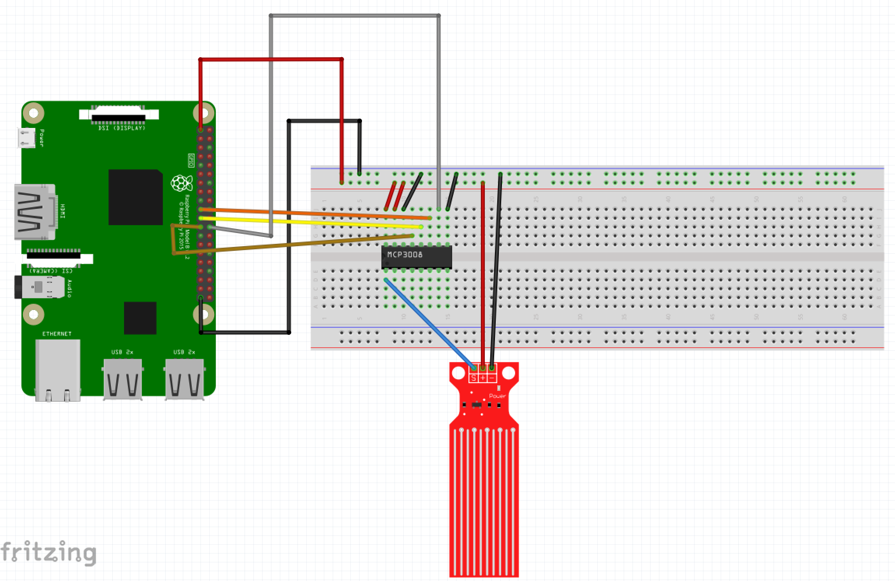

# Wiring the Water Level Sensor Solution
## Raspberry Pi 3 Windows IoT Core Pinout Diagram

## MCP3008 Pinout Diagram

## Fritzing Diagram

## Wiring Rundown
* Pi Pin 1 - 3v3 pin to Breadboard Power Rail (red jumper)
* Pi Pin 39 GND pin to Breadboard Ground Rail (black jumper)
* MCP3008 Pin 16 VDD to Breadboard Power Rail (small red wire jumper)
* MCP3008 Pin 15 VREF to Breadboard Power Rail (small red wire jumper)
* MCP3008 Pin 14 AGND to Breadboard Ground Rail (small black wire jumper)
* MCP3008 Pin 9 DGND to Breadboard Ground Rail (small black wire jumper)
* MCP3008 Pin 13 CLK pin to Pi Pin 23 SPI0 CLK
* MCP3008 Pin 12 DOUT pin to Pi Pin 21 SPI0 MISO pin
* MCP3008 Pin 11 DIN pin to Pi Pin 19 MOSI pin
* MCP3008 Pin 10 CS/SHDN pin to Pi Pin 24 SPI0 CS0 pin
* Water Level Sensor GND(-) pin to Breadboard Ground Rail (black jumper)
* Water Level Sensor VDD(+) pin to Breadboard Power Rail (red jumper)
* Water Level OUT/Signal (S) pin to MCP3008 Pin 1 CH0
