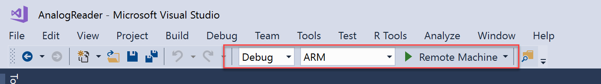
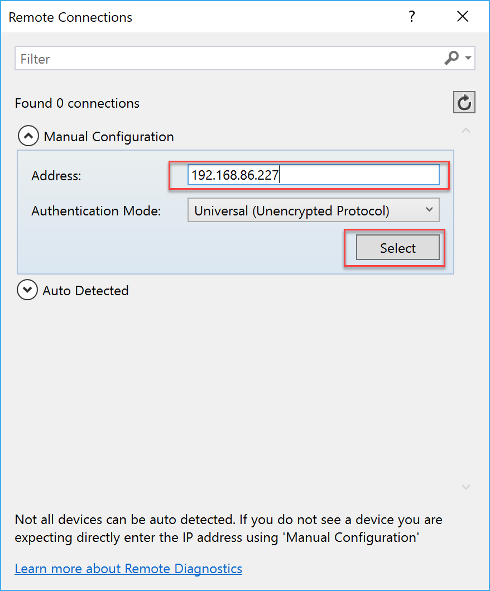
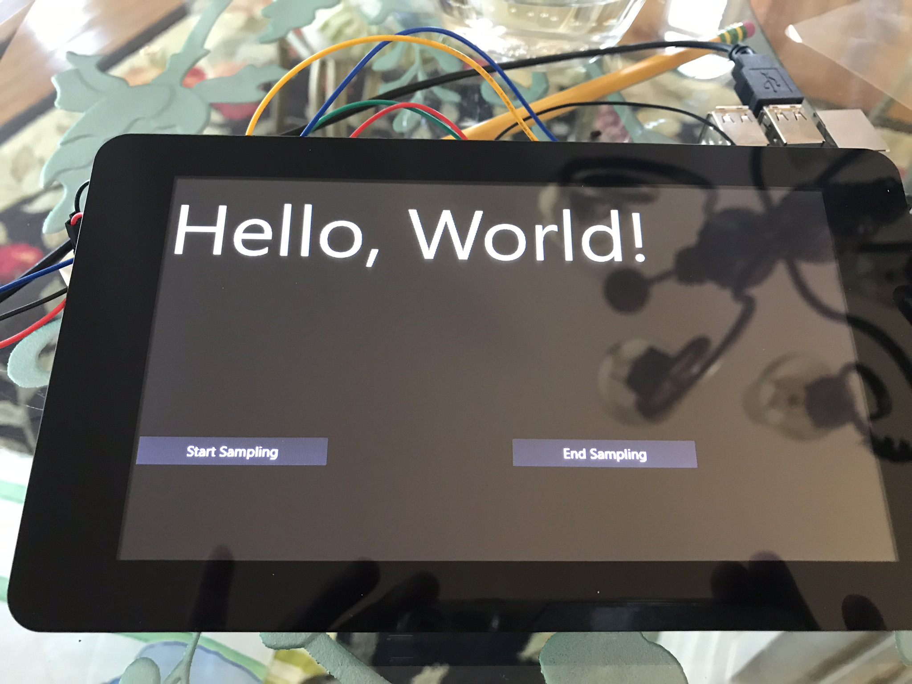

# Creating the UWP Application
Windows IoT Core running on the Raspberry Pi allows for UWP applications to run in the foreground. This allows you to implement applications such as kiosks and monitors to expose the data being collected by the device in a way that makes sense to your consumers.

## Deploying the application
Open the WaterLevelSensor/AnalogReader/AnalogReader.sln solution file in Visual Studio. From the Debug toolbar, select **Remote Machine**, and enter the IP address of the device that you'd like to deploy to. 
Ensure the build is set to Debug, and the CPU type to ARM, then Press F5 to run the application.

**Note** the first deployment of a UWP application will take a bit longer as it needs to install supporting frameworks. Subsequent deployments of applications will be quicker.

## The User Interface

This application is already setup to read sensor data every 100 milliseconds. Press the **Start Sampling** button to begin water level readings.

Start by submerging just the tip of the sensor in water, then slowly allow it to go deeper. You will notice that the values being read will increase. 

Remove the sensor from the water and dry it off, you will see the value returns to 0

## Understanding the code
Out of the box, the Raspberry Pi device does not support analog sensor readings. It only has a slew of digital (GPIO) pins. The water level sensor we are using is an analog sensor, so additional steps must be taken to translate this data into a format the Raspberry Pi will understand. In our schematic, we accomplished this by using an ADC chip, the MCP3008. Essentially, this chip will read the sensor data, translate it to digital, and communicate the information back to the Raspberry Pi.

In the project, there is a class called **MCP3008**. This class contains the logic used to connect the Raspberry Pi to the MCP3008 (ADC), and take a reading from the signal. The source code contained in this class expects 3.3v power, and that we are using SPI0 on the Raspberry Pi. The *bit-banging* code of the *_read* method in the class is defined based on the logic obtained from the datasheet. The connection and communication is all documented inline in the class, spend a moment now and review the code.

**MainPage.xaml** and **MainPage.xaml.cs** contains the UI logic for the sensor readings. It contains a timer that starts when the **Start Sampling** button is pressed. On each *tick* the application will obtain the water level sensor reading through SPI0, through the ADC on channel 0 and report it on the label on the MainPage screen.

