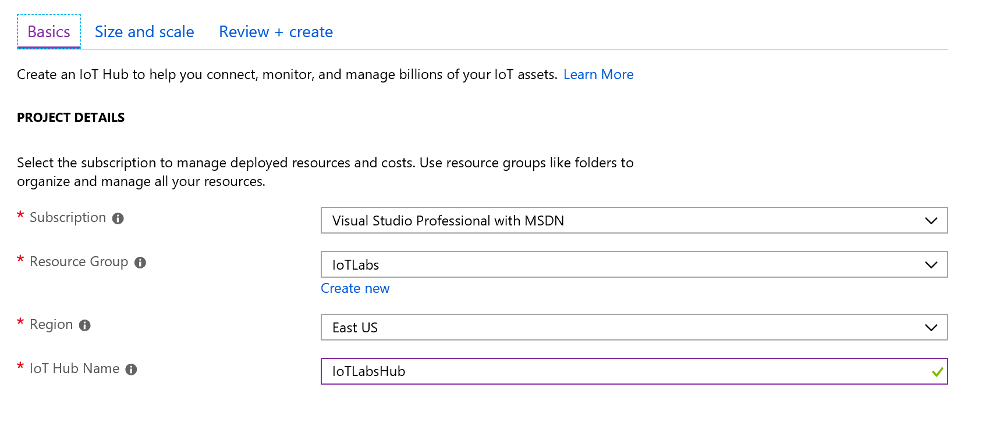

# Create the IoT Hub
* Log into the Azure Portal with your Microsoft Account
* Select **Resource Groups**
* Create a new Resource Group, name it *IoTLabs*
* Select **Create a new Resource**
* Search for IoT Hub - select to create a new hub
* In the *Basics* tab, ensure that you have the Proper Subscription and Resource Group selected, as well as the region nearest you. Provide the hub with a name that makes sense, as you will not be able to change it later. This name must be globally unique, so you can can create one with your initials and day plus month of your birthday, such as *cep0516iothub*. For the sake of this demonstration, I've named mine *iotlabshub* 

* Select the Size and Scale tab, and select S1 for the Standard Tier (Standard tier is required in order to use Device Twin features). 

* Click the *Review + Create* button, and on the review screen, click the *Create* button to create the IoT Hub.
* Deployment of the IoT Hub in Azure will take a few minutes.
