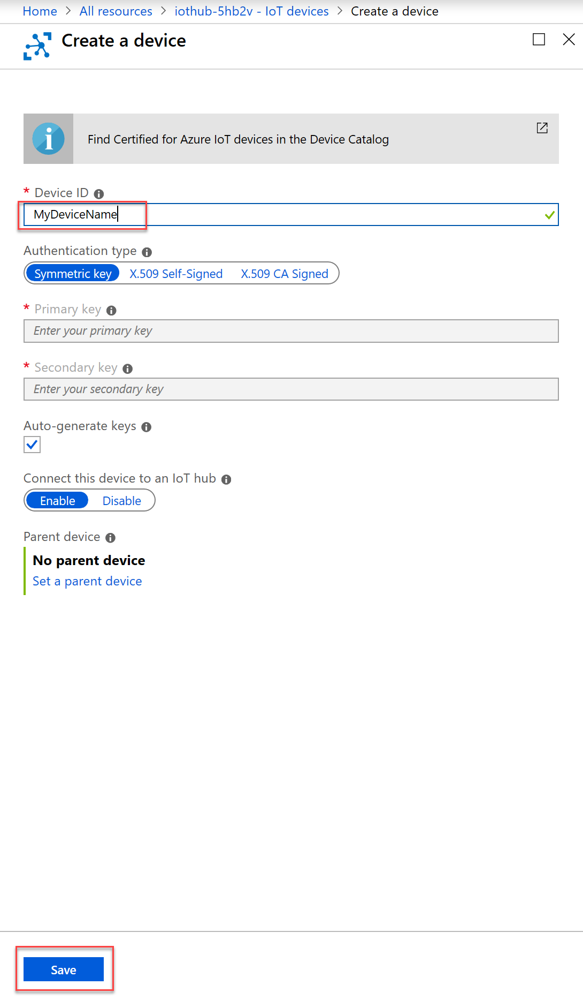
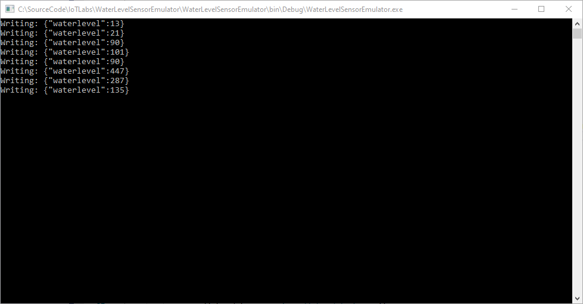
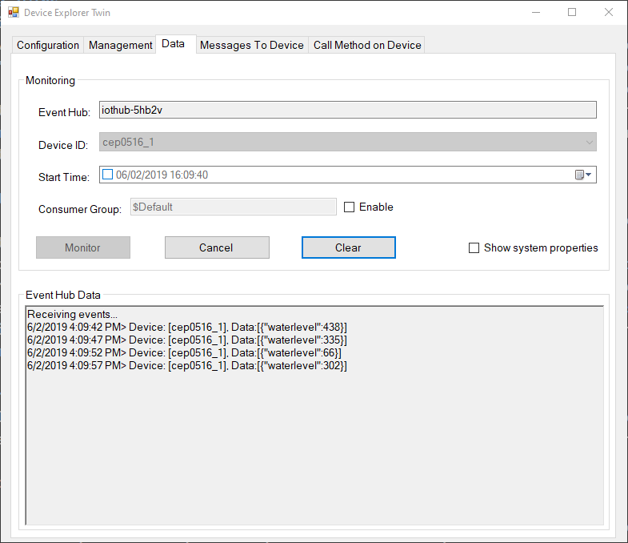
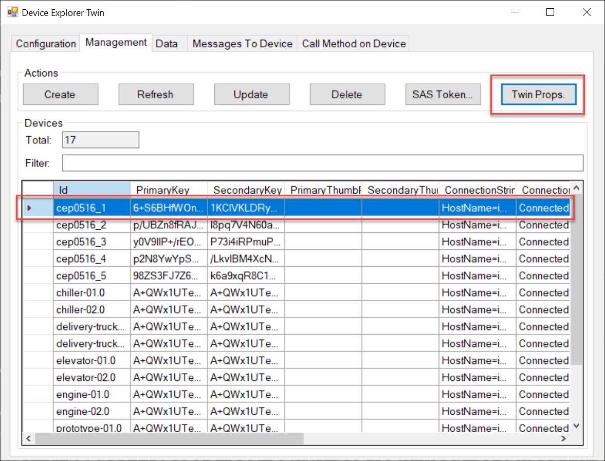
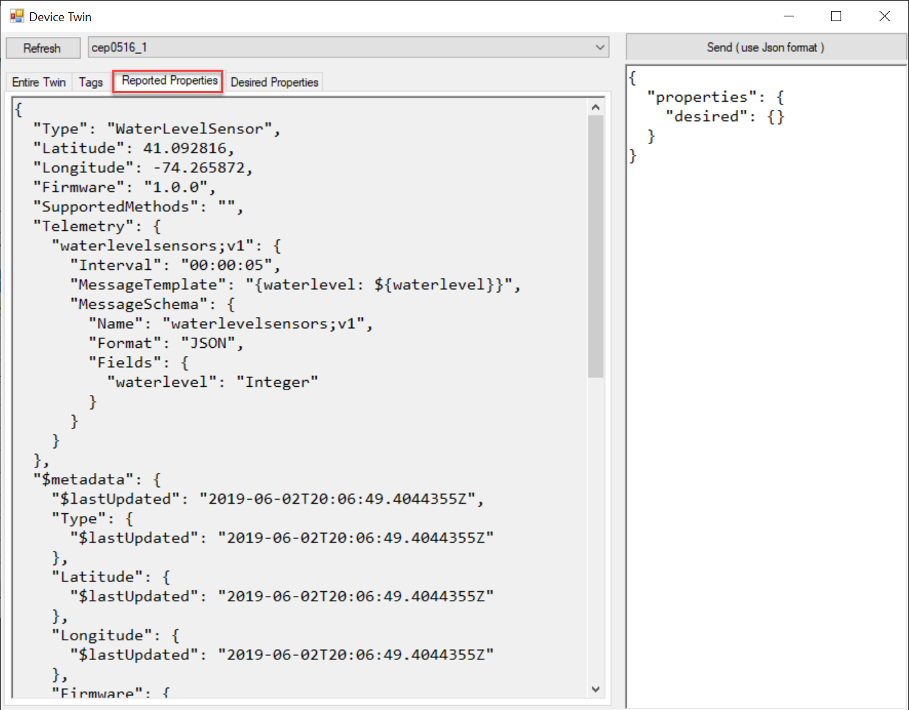
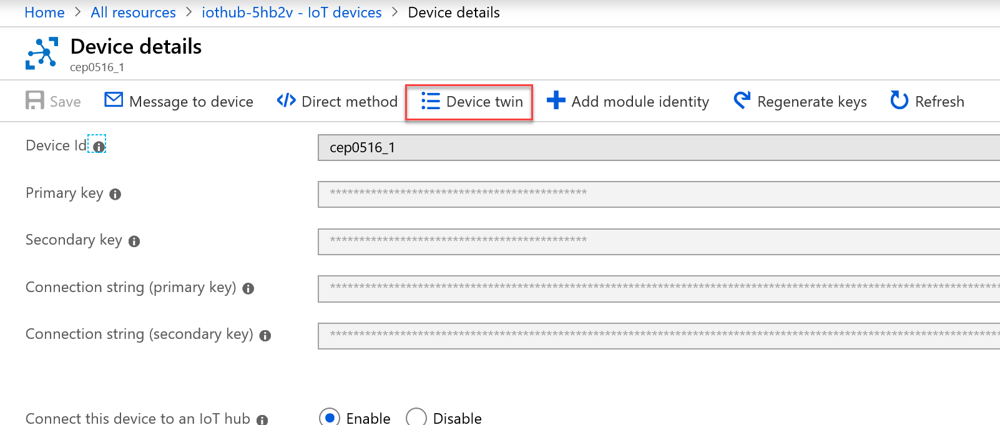
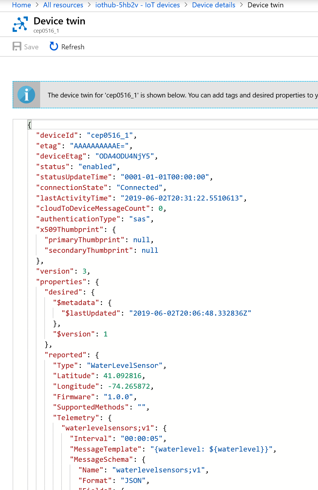

# Emulating a larger network of devices

## Use Cases
Many times when working on an IoT project, the hardware and software efforts are developed in parallel. Historically, hardware development takes a much longer time than software. Instead of delaying progress with the Software intiative, hardware data emulators can be put in place to bridge this gap.

Hardware data emulation is also valuable in load testing, as well as edge-case testing where obtaining a specific scenario/condition would be next to impossible using actual physical hardware. This data emulation may also be used by developers when implementing downstream functionality in the cloud, so that they don't require any physical IoT hardware to do their job.

## Solution Overview
Open **/WaterLevelSensorEmulator/WaterLevelSensorEmulator.sln** file. In a nutshell, this project is a C# project that will create, register and emulate any number of virtual hardware devices and send telemetry data to the IoT hub in parallel on a 5 second interval.

Each piece of virtual hardware generated by the emulator application will report water level telemetry, but will also provide important geographic location information. This data can be further analyzed to identify trends and correlate with weather forecasts to predict potential flooding conditions.

## Set IoT Hub values
Open **Program.cs**, replace the *_devicePrefix* value with that of your initials and birth year (line 17), then replace the values in *_iotHubConnectionString* (line 18) and *_iotHubHostName* (line 19) with the values that reflect your IoT Hub.

## Device Provisioning
A device needs to be provisioned with the IoT Hub prior to it being able to send telemetry data. There are multiple ways to provision a device to the IoT Hub, we will go over a few here.

In Lab 6, we provisioned a device using the IoT Dashboard application. 

You are also able to provision a device from the [Azure Portal](https://portal.azure.com). Open your IoT Hub resource, and in the left-hand menu, select **IoT devices**, then press the **Add** button.

Lastly, you can provision the device through code. In the case of the emulator project, we are using the **Microsoft.Azure.Devices** NuGet package which contains the Registry Manager class that will allow us to register the device with C#. Open **Program.cs** and you will see the *_registryManager* object get instantiated based on the IoT Hub connection string (line 33). The actual code for registring the device is found in the *GetOrRegisterDeviceInAzureAsync* method in the same file (line 97). 

Once a device is registered (or retrieved if it already exists), the device object will contain the symmetric key that will be used to create the Device Client that will be used to send telemetry data (line 50).

## Device Twins
Upon registering a device in the IoT Hub, it will have a digital representation stored in the cloud called a Device Twin. Device Twins are used to store metadata and state through a set of desired and reported properties. In our case, we're going to use Twins to report on the type of device, the telemetry message schema, as well as geographic location of the device. It is important to note, that this information isn't the telemetry data - it is representative of the device current state and doesn't get updated as often as telemetry data is sent. In the **Program.cs** source code, you will see reported properties being set via a *TwinCollection* and updated in the cloud between lines 50-61.

## Emulating the devices
Once the devices are created, and location information set via the update of the Device Twin - it's time for the devices to emulate data and send telemetry to the cloud. In this project, it is done via ActionBlocks. Each ActionBlock will generate a random water level reading, send the telemetry to Azure, then wait 5 seconds prior to restarting. The source code for this is located in the *CreateEmulatedDeviceReading* method, lines 76-95.  The encapsulation of the reading is located in the *WaterLevelSensorReading.cs* class - note that the actual telemetry message is just the *ToString()* method in this class, you can see the line that sends the telemetry in **Program.cs** on line 87.

## Run the Water Level Sensor Emulator
This application is a simple console application that is run directly on your desktop. Run the application, and after a second or two, you should see data similar to the following being output to the console window:

Open the Device explorer, and see that your devices are now listed in the drop down on the data tab. Select one of your emulated devices and monitor to view the telemetry being sent to the cloud.

Within the Device Explorer application, press the *Management* tab, and select one of your devices in the device list. Once selected, press the **Twin Props.** button to view the Device Twin information.

Open the Azure Portal, and open your IoT Hub resource once more. In the left hand menu, select **IoT Devices* then select one of your emulated devices.

In the Device Details screen, press the **Device Twin** button to view the Device Twin information sent from our emulator command.

