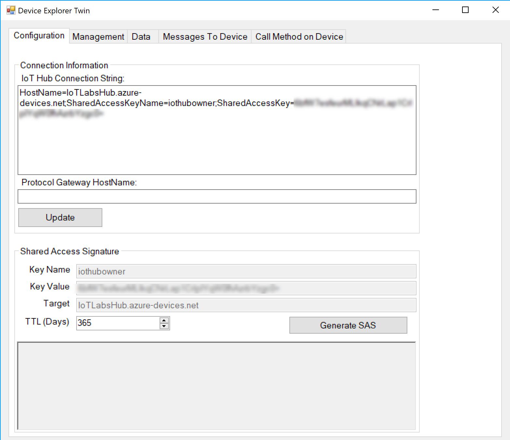

# Sending Telemetry Data to the IoT Hub

## Install the Windows Device Explorer
The Windows Device Explorer allows you to visualize data as it arrives into the IoT Hub. 
[Download and install this tool](https://aka.ms/aziotdevexp).

## Obtain connection information from the IoT Hub
In the Azure Portal - select the IoT Hub, and select *Shared Access Policies* in the Settings section. From there, select the *iothubowner* role, then copy the primary key connection string value. 

## Connect the Windows Device Explorer to the IoT Hub
Open the Windows Device Explorer application, and paste the connection string in the IoT Hub Connection String box.

## Configure application code with IoT Hub information
Open the /WaterSensorIoTHub/WaterSensorIoTHub.sln solution file. 